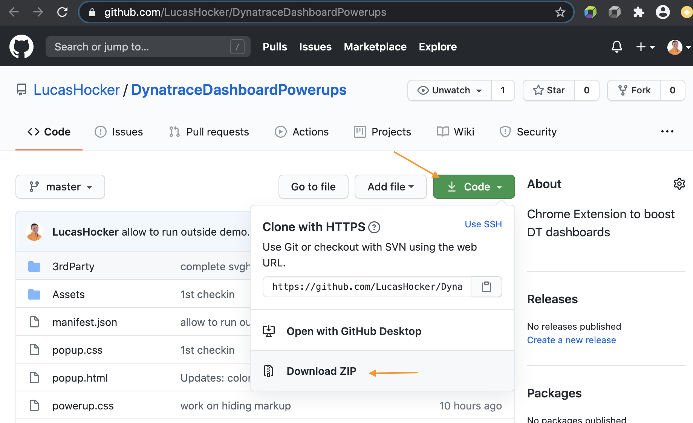

# Dynatrace Dashboard Powerups

This extension hacks Dynatrace dashboards to enable cool new features live, such as:
- Color changing tiles based on thresholds
- Color changing icons based on thresholds
- Tooltips on charts
   
*Please note: this is a community developed demonstration application. It is provided without any representations, warranties, or support from Dynatrace. If you have questions about this app, please post on our forum or create an issue on Github*

## Installation
Download the extension source


Unzip to a local folder

Enable in Chrome


## Powerup Howto
Currently for the powerups you need to add additional markup text in your dashboard tile titles. Soon, you will be able to add thresholds etc directly in the <a href="https://dynatrace.github.io/BizOpsConfigurator">BizOpsConfigurator</a> when you're deploying dashboards.

### Tooltips
Nothing required, just enable the extension as per above and refresh your browser on a dashboard.

### Colorize
For Single Value Tiles, either custom chart or USQL, you can add color coding by adding markup to the title:
`!colorhack:base=high;warn=90;crit=80`
Here's what each part of that means:
- `!colorhack:` this starts the markup
- `base=high` this is the base case for your metric, ie is it good to be low or high?
- `warn=90` this is the warning threshold, once breached color coding will be yellow
- `crit=80` this is the critical threshold, once breached color coding will be red
So in the example of availability, high is better. Greater than 90 would be green, 90 to 80 yellow, and 80 or less red.

### Icon indicators
This powerup renders icons in place of Markdown tiles. These icons change color to give a quick visual indication of environment / business health. For example, if payment processing was beyond a threshold hold, you might have a creditcard icon turn red. Here's how that might look:
```
[Extension Needed](https://github.com/LucasHocker/DynatraceDashboardPowerups)
!svghack:icon=creditcard;link=val3;base=high;warn=90;crit=85
```
Here's what each part means:
- Link to extension: this lets users without the extension know to download it
- `!svghack:` this starts the markup
- `icon=` this refers to an SVG file in the 3rdParty/node_modules/@dynatrace/barista-icons folder
- `link=` this is used to link to a Single Value Tile to get the comparison value
- `warn=` this is the warning threshold, once breached color coding will be yellow
- `crit=` this is the critical threshold, once breached color coding will be red
Just be sure to include the `!link=` with a matching string in the desired Single Value Tile
