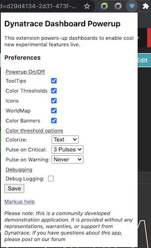
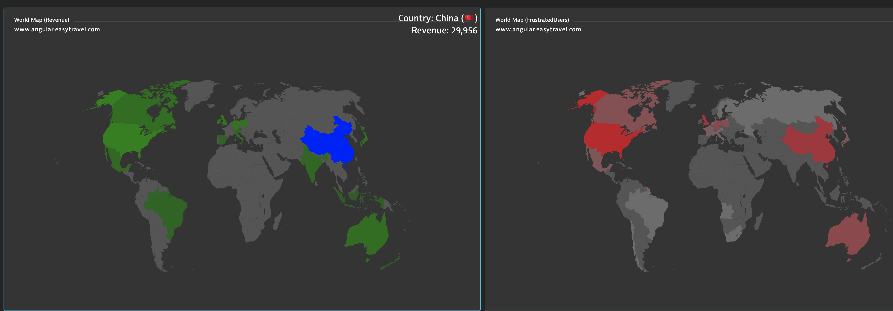
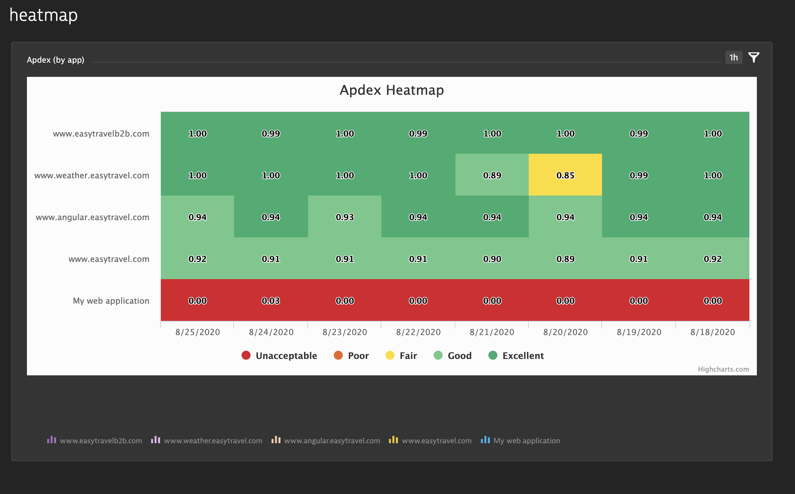

# Dynatrace Dashboard Powerups

This extension powers-up Dynatrace dashboards to enable cool new experimental features live, such as:
- Color changing tiles based on thresholds
- Color changing icons based on thresholds
- Tooltips on charts
- USQL values on world maps
   
*Please note: this is a community developed demonstration application. It is provided without any representations, warranties, or support from Dynatrace. If you have questions about this app, please post on our forum or create an issue on Github*

## Installation
1. Download the extension source


1. Unzip to a local folder

1. Enable in Chrome


1. Click the puzzle icon and pin Powerups


1. The icon will change from gray to blue when active


1. When a new update is released, repeat the above. Auto-update is currently in the backlog.

## Configure extension
1. Click blue powerup icon


1. Modify preferences


1. Click save. Note: you may need to refresh your page for changes to take effect.

## Powerup Howto
Currently for the powerups you need to add additional markup text in your dashboard tile titles. Soon, you will be able to add thresholds etc directly in the <a href="https://dynatrace.github.io/BizOpsConfigurator">BizOpsConfigurator</a> when you're deploying dashboards.

### Tooltips
Nothing required, just enable the extension as per above and refresh your browser on a dashboard.

Example:


### Colorize
For Single Value Tiles, either custom chart or USQL, you can add color coding by adding markup to the title:
`!PU(color):base=high;warn=90;crit=80`

Explanation:
- `!PU(color):` this starts the markup
- `base=high` this is the base case for your metric, ie is it good to be low or high?
- `warn=90` this is the warning threshold, once breached color coding will be yellow
- `crit=80` this is the critical threshold, once breached color coding will be red
So in the example of availability, high is better. Greater than 90 would be green, 90 to 80 yellow, and 80 or less red.

Example:


### Icon indicators
This powerup renders icons in place of Markdown tiles. These icons change color to give a quick visual indication of environment / business health. For example, if payment processing was beyond a threshold hold, you might have a creditcard icon turn red. Here's how that might look:
```
[Extension Needed](https://github.com/LucasHocker/DynatraceDashboardPowerups)
!PU(svg):icon=creditcard;link=val3;base=high;warn=90;crit=85
```

Explanation:
- Link to extension: this lets users without the extension know to download it
- `!PU(svg):` this starts the markup
- `icon=` this refers to an SVG file in the 3rdParty/node_modules/@dynatrace/barista-icons folder
- `link=` this is used to link to a Single Value Tile to get the comparison value
- `warn=` this is the warning threshold, once breached color coding will be yellow
- `crit=` this is the critical threshold, once breached color coding will be red
Just be sure to include the `!PU(link):` with a matching string in the desired Single Value Tile

Example:


### World maps
This powerup reloads the data in world maps with that from a USQL table. This allows you to map arbitrary things like revenue. It also enables click or scrollwheel to zoom. Click in an ocean to reset zoom. Add markup to your USQL table's title like this:
`Revenue !PU(map):color=green;link=Apdex`

Explanation:
- Revenue: title for your USQL table and Worldmap
- `!PU(map):` indicates this is a map powerup
- `color=` what color scale to use, e.g. "green" or "#E9422F"
- `link=` refers to the standard metric picked for the chart in the OOTB tile configuration. This allows you to have multiple worldmaps driven by multiple USQL tables

Example:


### Banner
If you have multiple environment with dashboards up on screens and need an easy way of telling which is say Production and which one is say QA, you can color code the top of the dashboard. Use a dashboard tag like this:
`!PU(banner):color=purple`

Explanation:
- `!PU(banner):` indicates this dashboard tag is a banner powerup
- `color=` what color background to make the banner, e.g. "purple" or "#B6E5F8"

Example:


### Line chart threshold
If you would like a chart that shows as one color above a threshold but a different color below, this powerup enables that. Add markup to to the chart title like so:
`!PU(line):thld=4000;hcol=green;lcol=red`

Explanation:
- `!PU(line):` indicates this linechart should have a threshold
- `thld=4000;` the threshold (Note: does not currently support units)
- `hcol=green;` the color above the threshold
- `lcol=red` the color below

Example:


### USQL Stacked Bar chart
This powerup switches to a stacked bar chart for a USQL result instead of stacked xaxis labels. Change the title like this:
`!PU(usqlstack):color=green`

Explanation:
- `!PU(usqlstack):` indicates the powerup
- `color=green` NOT YET IMPLEMENTED

Example:


### Heatmap (experimental)
Currently this powerup can display a heatmap based on a bar chart of web application apdex. Eventually, it will be more generic.
`!PU(heatmap):`

Example:


### UserAction Sankey chart
This powerup shows UserActions for your application, where they start, end, how many, do users circle in loops, etc. Create a USQL query, like this:
```
select useraction.name, useraction.matchingConversionGoals, useraction.apdexCategory, useraction.isEntryAction, useraction.isExitAction FROM usersession WHERE useraction.application="www.angular.easytravel.com"
```

encoded with a title like this:
`Angular Easy Travel UserJourneys !PU(sankey):link=sankey1`

and Markdown tile to get swapped out like this:
```
[Extension Needed](https://github.com/LucasHocker/DynatraceDashboardPowerups)
!PU(link):sankey1
```

Example:


Notes:
- To increase/decrease the amount of clutter, use the plus and minus buttons. These slice the data in the USQL query.
- To get even more data from the USQL query, edit the dashboard JSON and add to the USQL tile (default 50, max 5000, more can result in slower load):
`"limit": 500`